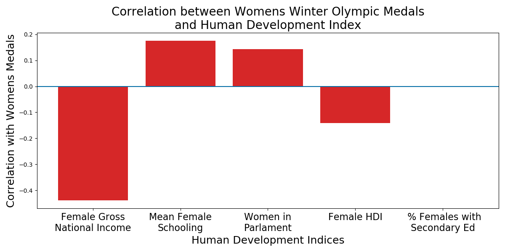
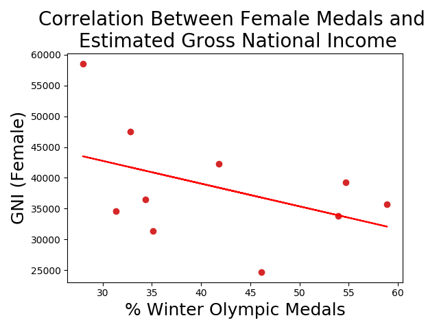

# Women in the Winter Olympics
## History
When the olympic games were originally founded in ancient greece there were no female participants. The first modern olympic games, held in 1896, were also exclusively for men. However, the very next olympics included women's events in both tennis and golf. 

In 1924 the International Olympic Committee added a winter sports week to the olympic competition and this event became the first Winter Olympic Games. Women's events were included in the Winter Games from the beginning, with figure skating including both a women's and a pair skate. Women's participation continued to grow until in 2010 there were only three countries that had never sent a female athlete to the games and in the 2012 London Games every country competing included at least one female athlete.

By evaluating the increase in women's events over time I hope to discern if any major historical moments correspond to increases in women's events. I also hope to discover a correlation between a country's human development index gender specific indicators and that country's women's event medals.

## Data
**Winter Olympic Medals**

A table containing all the medals awarded at the Winter Olympics, and including data about the year, gender, country, and event was obtained from data.world. 

|    |   Year | Sport                | Event               | Country     | Gender   |   Medal Rank | Medal   | Name of Athlete or Team   |   Age of Athlete |
|---:|-------:|:---------------------|:--------------------|:------------|:---------|-------------:|:--------|:--------------------------|-----------------:|
|  0 |   1924 | Bobsled              | Men's Four/Five     | Switzerland | Men      |            1 | gold    | Switzerland-1             |              nan |
|  1 |   1924 | Bobsled              | Men's Four/Five     | Britain     | Men      |            2 | silver  | Britain-1                 |              nan |
|  2 |   1924 | Bobsled              | Men's Four/Five     | Belgium     | Men      |            3 | bronze  | Belgium-1                 |              nan |
|  3 |   1924 | Cross-Country Skiing | Men's 18 Kilometers | Norway      | Men      |            1 | gold    | Thorleif Haug             |               29 |
|  4 |   1924 | Cross-Country Skiing | Men's 18 Kilometers | Norway      | Men      |            2 | silver  | Johan Grøttumsbraaten    |               24 |

The gender column was one hot encoded and two dataframes were created for evaluation. One dataframe was grouped by year, sport, and event and the medals were removed so that the number of events could be directly compared between men and women. The number of events in each year were totaled and used to calculate the percent of events for women.

|   Year |   male_events |   female_events |   total_events |   %_female_events |
|-------:|--------------:|----------------:|---------------:|------------------:|
|   1924 |            14 |               1 |             15 |           6.66667 |
|   1928 |            11 |               1 |             12 |           8.33333 |
|   1932 |            12 |               1 |             13 |           7.69231 |
|   1936 |            14 |               2 |             16 |          12.5     |
|   1948 |            17 |               4 |             21 |          19.0476  |
_showing first five rows_

Another dataframe was grouped by country to obtain the sum of medals in men's and women's events for the history of the Winter Olympics. 

| Country   |   male_medals |   female_medals |   mixed_medals |   total_medals |
|:----------|--------------:|----------------:|---------------:|---------------:|
| Australia |             5 |               7 |              0 |             34 |
| Austria   |           143 |              70 |              5 |            722 |
| Belarus   |             8 |               7 |              0 |             46 |
| Belgium   |             4 |               0 |              1 |             18 |
| Britain   |            13 |              11 |              2 |             78 |
_showing first five rows_

These dataframes were used to create the following plots, which show the increase in the percent of events for women over time, the comparison of men's and women's events over time and the medals for men's and women's events for the countries with at least 50 medals.

## Winter Olympics Gender Equality Plots

The largest spike in the percent of events including women occurred in 1960 with a 12% increase. The 1960 Winter Olympics were held in Squaw Valley, CA and the 1960s were the peak of the feminism movement in the United States. Unfortunately, it is likely that this correlation is just coincidental. The 1960 olympics added biathlon to the men's events and four distances of speed skating to the women's events. In order to save money the Olympic Committee decided not to build a bobsled run, causing the men to loose three medal events. This reduction in the men's events, along with the addition of the women's events, is what caused the large spike. 

Women's events are slowly catching up to men's events in the Winter Olympics. The steepest increases occured in the 1960s and the 1980s. There is a gap in the 1940s when the Olympics were not constested due to the second world war. The switch to Summer and Winter olympics occuring on separate four-year cycles occurred in 1994, as can be seen on the plot.

This plot was abbreviated to only include countries with at least 50 medals since 1924. The dominace of Norway in men's events is clearly evident. It is also interesting to note the Germans are the only competitors to produce more women's event medals than men's events. 

## Human Development Index Correlation

"The Human Development Index (HDI) was created to emphasize that expanding human choices should be the ultimate criteria for assessing development results. Economic growth is a means to that process but is not an end in itself." - hdr.undp.org

HDIs are released by the United Nations Development Programme on a nearly annual basis and include information on a multitude of different human factors. The HDI for the 11 countries with at least 50 medals in the Winter Olympics from 1994 to 2014 were collected and reduced to only include the indices with the words 'female' or 'woman' in the name. A few of these indices were dropped because they did not include data for many of the countries, which left 18 HDI indices. Each of these indices were compared to the percent of medal's won by women in the 11 countries to determine correlations. 

Most of the HDI indices showed little to no correlation with percent of winter olympic medals won by females. The HDI with the highest correlation was the Estimated Gross National Income per capita, female and this was, surprisingly, a negative correlation. The GNI and percent women's medals can be seen in the plot below. 

## Further Analysis
The resluts of the correlations with HDI indices was surprising. I would like to continue investigating these correlations by including Summer Olympics in the analysis as well as creating evaluations for female atheletes instead of only female medalists. 