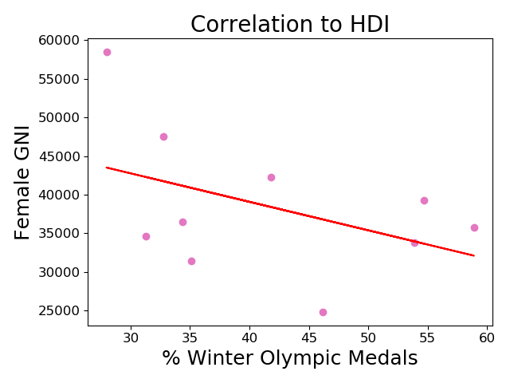
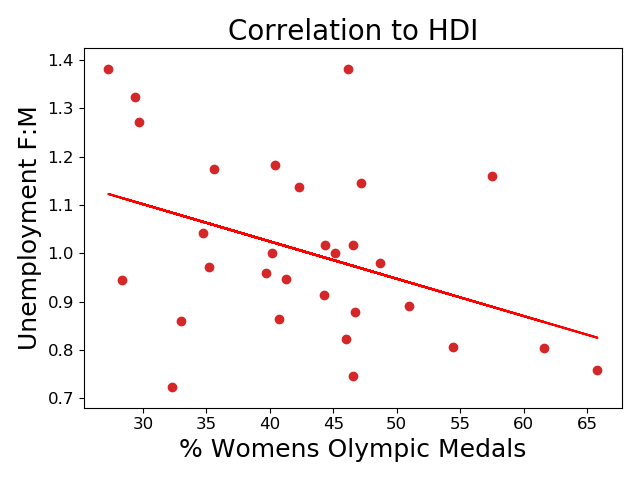

# Women in the Winter Olympics

## Table of Contents
1. [History](#history)
2. [Data](#data)
3. [Winter Olympics Gender Equlaity](#winter-olympics-gender-equality)
4. [Human Development Index Correlation](#human-development-index-correleation)
5. [Further Analysis](#further-analysis:-correlations-to-all-olympic-games)
6. [Future Work](#future-work)

## History
When the olympic games were originally founded in ancient Greece there were no female participants. The first modern olympic games, held in 1896, were also exclusively for men. However, the very next olympics included women's events in both tennis and golf. 

In 1924 the International Olympic Committee added a winter sports week to the olympic competition and this event became the first Winter Olympic Games. Women's events were included in the Winter Games from the beginning, with figure skating including both a women's and a pair skate. Women's participation continued to grow until in 2010 there were only three countries that had never sent a female athlete to the games and in the 2012 London Games every competing country sent at least one female athlete.

By evaluating women's events in the olympics over time I hope to discern if any major historical moments coincide with increases in women's events. I also hope to discover a correlation between a country's human development index gender specific indicators and that country's women's event medals.

## Data
**Winter Olympic Medals**

A table containing all the medals awarded at the Winter Olympics, and including information about the year, gender, country, and event was obtained from [data.world.](https://data.world/makeovermonday/2018w7-the-winter-olympics) 

|   Year | Sport                | Event               | Country     | Gender   |   Medal Rank | Medal   | Name of Athlete or Team   |   Age of Athlete |
|-------:|:---------------------|:--------------------|:------------|:---------|-------------:|:--------|:--------------------------|-----------------:|
|   1924 | Bobsled              | Men's Four/Five     | Switzerland | Men      |            1 | gold    | Switzerland-1             |              nan |
|   1924 | Bobsled              | Men's Four/Five     | Britain     | Men      |            2 | silver  | Britain-1                 |              nan |
|   1924 | Bobsled              | Men's Four/Five     | Belgium     | Men      |            3 | bronze  | Belgium-1                 |              nan |
|   1924 | Cross-Country Skiing | Men's 18 Kilometers | Norway      | Men      |            1 | gold    | Thorleif Haug             |               29 |
|   1924 | Cross-Country Skiing | Men's 18 Kilometers | Norway      | Men      |            2 | silver  | Johan Grøttumsbraaten    |               24 |

_showing first five rows_

The gender column was one hot encoded and two dataframes were created for evaluation. One dataframe was grouped by year, sport, and event and the medals were removed so that the number of events could be directly compared between men and women. The number of events in each year were totaled and used to calculate the percent of events for women.

|   Year |   Mens Events |   Womens Events |   Total Events |   % Female Events |
|-------:|--------------:|----------------:|---------------:|------------------:|
|   1924 |            14 |               1 |             15 |           6.66667 |
|   1928 |            11 |               1 |             12 |           8.33333 |
|   1932 |            12 |               1 |             13 |           7.69231 |
|   1936 |            14 |               2 |             16 |          12.5     |
|   1948 |            17 |               4 |             21 |          19.0476  |

_showing first five rows_

Another dataframe was grouped by country to obtain the total medals won by each country in men's and women's events for the history of the Winter Olympics. 

| Country   |   Mens Medals |   Womens Medals |   Mixed Medals |   Total Medals |
|:----------|--------------:|----------------:|---------------:|---------------:|
| Australia |             5 |               7 |              0 |             34 |
| Austria   |           143 |              70 |              5 |            722 |
| Belarus   |             8 |               7 |              0 |             46 |
| Belgium   |             4 |               0 |              1 |             18 |
| Britain   |            13 |              11 |              2 |             78 |

_showing first five rows_

These dataframes were used to create the following plots, which show the increase in the percent of events for women over time, the comparison of men's and women's events over time and the medals for men's and women's events for the countries with at least 50 medals.

## Winter Olympics Gender Equality

The largest spike in the percent of events including women occurred in 1960 with a 12% increase. The 1960 Winter Olympics were held in Squaw Valley, CA and the 1960s were the peak of the feminism movement in the United States. Unfortunately, it is likely that the timing of this spike is just coincidental. The 1960 olympics added biathlon to the men's events and four distances of speed skating to the women's events. In order to save money the Olympic Committee decided not to build a bobsled run, causing the men to lose three medal events. This reduction in the men's events, along with the addition of the women's events, is what caused the large spike. 

This plot was abbreviated to only include countries with at least 50 medals since 1994. The dominace of Norway in men's events is clearly evident. It is also interesting to note Germany has the most medals in women's events, even though this count does not include medals awarded to East Germany or West Germany during the cold war. 

## Human Development Index Correlation

"The Human Development Index (HDI) was created to emphasize that expanding human choices should be the ultimate criteria for assessing development results. Economic growth is a means to that process but is not an end in itself." - [hdr.undp.org](http://hdr.undp.org/en/content/human-development-index-hdi)

HDIs are released by the United Nations Development Programme on a nearly annual basis and include information on a multitude of different human factors. The HDI for the 11 countries with at least 50 medals in the Winter Olympics from 1994 to 2014 were collected from UNDP's Human Development Reports Office profile on [data.world](https://data.world/hdro). Each table was cleaned using a pandas PivotTable. The resulting DataFrame was reduced to only include the indices with the words 'female' or 'women' in the name. A few of these indices were dropped because they did not include data for many of the countries, which left 17 HDI indices. Each of these indices were compared to the percent of medal's won by women in the 11 countries to determine correlations. 

Since most of the HDI indices showed little to no correlation with percent of winter olympic medals won by females, a small number were selected for plotting. The HDI with the highest correlation was the Estimated Gross National Income per capita, female and this was, surprisingly, a negative correlation. The GNI and percent women's medals can be seen in the plot below. 

## Further Analysis: Correlations to all Olympic Games
The resluts of the correlations with HDI indices was surprising. I was able to find a dataset on [kaggle.com](https://www.kaggle.com/heesoo37/120-years-of-olympic-history-athletes-and-results) that included all athletes sent to the games up to the 2016 Games in Rio. I used this dataset to repeat my analysis of countries gender performance in the games. The Summer Olympics has more events than the Winter Olympics as can be seen in the plot below. The summer events dwarfs the winter events.

This increase in the number of events increased the number of countries with relevant medal counts from 11 to 30. The Gross National Income, which had been the best correlated HDI now shows almost no correlation, but the Unemployment correlation became even stronger. 

The p-values of the correlation of  with all olympic medals were statistically significant, while the correlations determined with only the winter medals were not. 

## Future Work
After seeing the impact that adding the summer olympic medals had on the correlations and the p-values, I would like to continue investigating these trends by using athlete data instead of only event medals data. Since only a fraction of the athletes that attend the games wind up winning medals, the increase in data points could strengthen the correlations and would provide more confidence in the validity of the calculated correlations. I would also like to evaluate all of the HDI indices to see if any other indices showed more correlation with the womens medals than the gender specific medals. 
