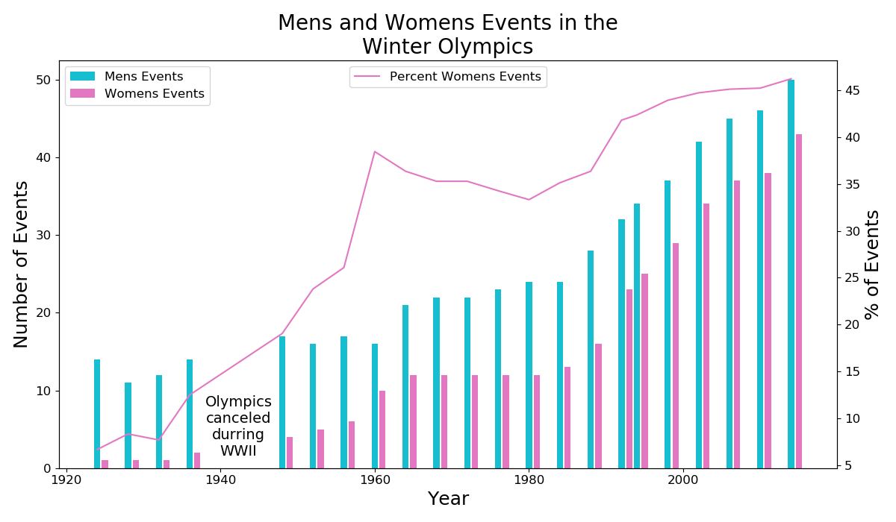
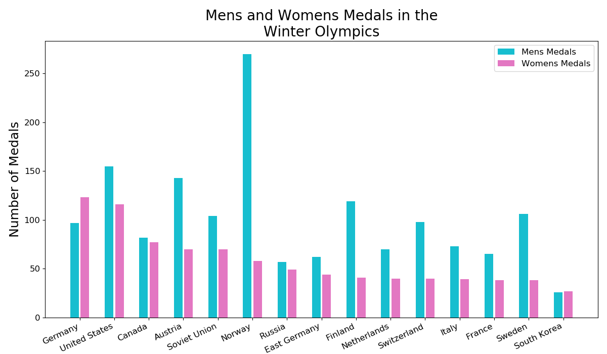

# Women in the Winter Olympics

Photo from [CNN Sports](https://edition.cnn.com/2018/02/09/sport/gallery/winter-olympics-0210/index.html) of the medalists from the 15km Cross Country Ski event. With this medal the silver medalist, Marit Bjorgen became the most decorated woman in the winter olympics.

## Table of Contents
1. [Motivation](#motivation)
2. [History](#history)
3. [Data](#data)
4. [Winter Olympics Gender Equlaity](#winter-olympics-gender-equality)
5. [Human Development Index Correlation](#human-development-index-correleation)
6. [Further Analysis](#further-analysis)
7. [Future Work](#future-work)

## Motivation
By evaluating women's events in the olympics over time I hope to discern if any major historical moments coincide with increases in women's events. I also hope to discover a correlation between a country's human development index gender specific indicators and that country's women's event medals.

## History
When the olympic games were originally founded in ancient Greece there were no female participants. The first modern olympic games, held in 1896, were also exclusively for men. However, the very next olympics included women's events in both tennis and golf. 

In 1924 the International Olympic Committee added a winter sports week to the olympic competition and this event became the first Winter Olympic Games. Women's events were included in the Winter Games from the beginning, with figure skating including both a women's and a pair skate. Women's participation continued to grow until in 2010 there were only three countries that had never sent a female athlete to the games and in the 2012 London Games every competing country sent at least one female athlete.

## Data
**Winter Olympic Medals**

A table containing all the medals awarded at the Winter Olympics, and including information about the year, gender, country, and event was obtained from [data.world.](https://data.world/makeovermonday/2018w7-the-winter-olympics) 

|   Year | Sport                | Event               | Country     | Gender   |   Medal Rank | Medal   | Name of Athlete or Team   |   Age of Athlete |
|-------:|:---------------------|:--------------------|:------------|:---------|-------------:|:--------|:--------------------------|-----------------:|
|   1924 | Bobsled              | Men's Four/Five     | Switzerland | Men      |            1 | gold    | Switzerland-1             |              nan |
|   1924 | Bobsled              | Men's Four/Five     | Britain     | Men      |            2 | silver  | Britain-1                 |              nan |
|   1924 | Bobsled              | Men's Four/Five     | Belgium     | Men      |            3 | bronze  | Belgium-1                 |              nan |
|   1924 | Cross-Country Skiing | Men's 18 Kilometers | Norway      | Men      |            1 | gold    | Thorleif Haug             |               29 |
|   1924 | Cross-Country Skiing | Men's 18 Kilometers | Norway      | Men      |            2 | silver  | Johan Grøttumsbraaten    |               24 |

_Table 1: Original dataset, showing first five rows_

The gender column was one hot encoded and two dataframes were created for evaluation. One dataframe was grouped by year, sport, and event and the medals were removed so that the number of events could be directly compared between men and women. The number of events in each year were totaled and used to calculate the percent of events for women.

|   Year |   Mens Events |   Womens Events |   Total Events |   % Womens Events |
|-------:|--------------:|----------------:|---------------:|------------------:|
|   1924 |            14 |               1 |             15 |           6.67 |
|   1928 |            11 |               1 |             12 |           8.33 |
|   1932 |            12 |               1 |             13 |           7.69 |
|   1936 |            14 |               2 |             16 |          12.50 |
|   1948 |            17 |               4 |             21 |          19.05 |

_Table 2: Men and women's events by year, showing first five rows_

Another dataframe was grouped by country to obtain the total medals won by each country in men's and women's events for the history of the Winter Olympics. The percent of the total medals won by women was also determined and used for the correlation testing. The percent of medals, instead of total count of women's medals, was used in order to avoid biasing the data to the typical powerhouse countries that send more athletes and win more medals, such as the United States and Russia. 

| Country       |   Mens Medals |   Womens Medals |   Total Medals |   % Womens Medals |
|:--------------|--------------:|----------------:|---------------:|------------------:|
| Germany       |            97 |             123 |            220 |           55.91 |
| United States |           155 |             116 |            271 |           42.80 |
| Canada        |            82 |              77 |            159 |           48.43 |
| Austria       |           143 |              70 |            213 |           32.86 |
| Soviet Union  |           104 |              70 |            174 |           40.23 |

_Table 3: Men and women's medals by country, showing first five rows_

These dataframes were used to create the following plots, which show the increase in the percent of events for women over time, the comparison of men's and women's events over time and the medals for men's and women's events for the countries with at least 50 medals.

## Winter Olympics Gender Equality

_Figure 1: The number of events in the Winter Olympics for men and women and the percent of the total events in which women compete. The mixed events were not included in this figure._

The largest spike in the percent of events including women occurred in 1960 with a 12% increase. The 1960 Winter Olympics were held in Squaw Valley, CA and the 1960s were the peak of the feminism movement in the United States. Unfortunately, it is likely that the timing of this spike is just coincidental. The 1960 olympics added biathlon to the men's events and four distances of speed skating to the women's events. In order to save money the Olympic Committee decided not to build a bobsled run, causing the men to lose three medal events. This reduction in the men's events, along with the addition of the women's events, is what caused the large spike. 

_Figure 2: The number of Winter Olympic medals won by men and women in countries with at least 50 medals. Mixed medals are not included._

This plot was abbreviated to only include countries with at least 50 medals. The dominace of Norway in men's events is clearly evident. It is also interesting to note Germany has the most medals in women's events, even though this count does not include medals awarded to East Germany or West Germany during the time of the Cold War. 

## Human Development Index Correlation

>"The Human Development Index (HDI) was created to emphasize that expanding human choices should be the ultimate criteria for assessing development results. Economic growth is a means to that process but is not an end in itself." - [hdr.undp.org](http://hdr.undp.org/en/content/human-development-index-hdi)

HDIs are released by the United Nations Development Programme on a nearly annual basis and include information on a multitude of different human factors. The HDI for the 11 countries with at least 50 medals in the Winter Olympics from 1994 to 2014 were collected from UNDP's Human Development Reports Office profile on [data.world](https://data.world/hdro). Each table was cleaned using a pandas PivotTable. The resulting DataFrame was reduced to only include the indices with the words 'female' or 'women' in the name. A few of these indices were dropped because they did not include data for many of the countries, which left 17 HDI indices. Each of these indices were compared to the percent of medal's won by women in the 11 countries to determine correlations. 

Correlations were calculated using the Pearson test and the significance level was set to 0.10. This significance level was corrected using the Bonferoni correction with a resulting signifcance level of 0.00059. The Bonferoni correction is used when testing multiple values in the same test. Testing multiple values increase the likelihood of getting a result by chance, so lowering the significance level helps to avoid incorrectly stating a result as significant. 

| HDI Indicator                |   Correlation       |
|:-----------------------------|--------------------:|
| Mean Female Years of School  |               0.210 |
| Female Gross National Income |              -0.459 |
| Female HDI                   |              -0.281 |
| Unemployment Ratio (F:M)     |              -0.052 |
| Women in Parlament           |              -0.476 |

_Table 4: Pearson's correlation coefficients for Human Development Indicators and the percent of Winter Olympic medals won by women for 11 counties. The Pearson's coefficient indicates the strength of the correlation with 0 being no correlation and 1 being directly, linearly correlated. Negative values indicate a negative correlation and positive values indicate a positive correlation._

Most of the HDI indices showed little to no correlation with percent of winter olympic medals won by females. The above table includes the correlations and p-values (likelihood of occuring by chance) for indices that I expected to show some corrletion with medals. The HDI with the highest correlation was the Estimated Gross National Income per capita for females and this was, surprisingly, a negative correlation. The GNI and percent women's medals can be seen in the plot below. 

_Figure 3: Scatter plot of the National Gross Income for Females and the % of Winter Olympic medals won by women. The GNI for Females is derived from the ratio of female to male wages, female and male shares of economically active population and gross national income. The values are reported as international dollars using purchasing power parity rates._

## Further Analysis
**Correlations to all Olympic Games**

The resluts of the correlations with HDI indices was surprising. I was able to find a dataset on [kaggle.com](https://www.kaggle.com/heesoo37/120-years-of-olympic-history-athletes-and-results) that included all athletes sent to the games up to the 2016 Games in Rio. I used this dataset to repeat my analysis of countries' gender performance in the games. The Summer Olympics has over three times as many events than the Winter Olympics as can be seen in the plot below. The summer events are stacked on top of the winter events for the years before the Olympic games switched to alternating 4-year cycles.

_Figure 4: Mens and womens events in the Summer and Winter Olympics_

This increase in the number of events increased the number of countries with relevant medal counts from 11 to 30. The increase in countries allows for more data points when evaluating the correlation between the Human Development Indicators and the percent of medals won by women. 

| HDI Indicator                |   Correlation        |
|:-----------------------------|---------------------:|
| Mean Female Years of School  |              -0.233  |
| Female Gross National Income |              -0.384  |
| Female HDI                   |               0.391  |
| Unemployment Ratio (F:M)     |              -0.204  |
| Women in Parlament           |              -0.321  |

_Table 4: Pearson's correlation coefficients for Human Development Indicators and the percent of Olympic medals won by women for 30 counties. The Pearson's coefficient indicates the strength of the correlation with 0 being no correlation and 1 being directly, linearly correlated. Negative values indicate a negative correlation and positive values indicate a positive correlation._

_Figure 5: Scatter plot of Female HDI and the % of Olympic medals won by women. The female HDI is a composite index measuring average achievement in three basic dimensions of human development: a long and helathy life, knowledge and a decent standard of living. The UNDR lists 0.874 as very high human evelopment and 0.446 as low human development._

## Conclusion
Though there are some trends in the data and some slight correlations, none of the indicies including the words 'female' or 'women' showed a significant correlation to the percent of medals won by women in the Olympic games. Those indicies that did show some correlation had a probability of occuring by chance execeding the set significance level. This indicates these indices should not be considered correlate to the medals. 

## Future Work
After seeing the impact that adding the summer olympic medals had on the correlations and the p-values, I would like to continue investigating these trends by using athlete data instead of only event medals data. Since only a fraction of the athletes that attend the games wind up winning medals, the increase in data points could strengthen the correlations and would provide more confidence in the validity of the calculated correlations. I would also like to evaluate all of the HDI indices to see if any other indices showed more correlation with the women's medals than the gender specific indices. 
