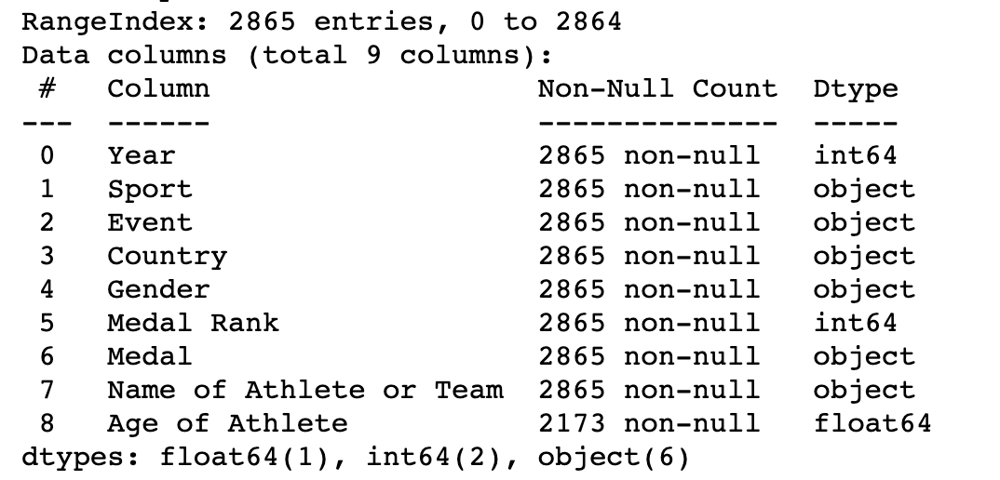
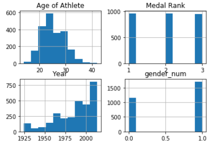
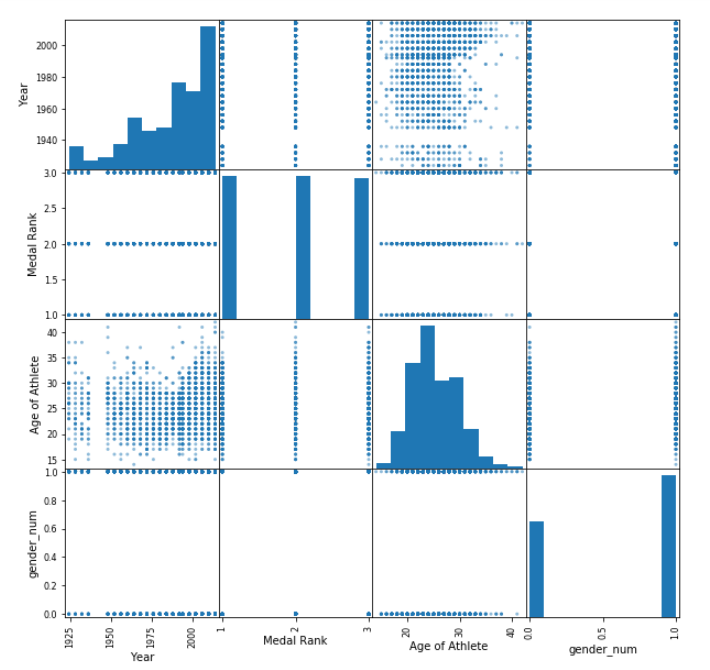

# Martha Wood Capstone I Proposal
## Questions
**How have women's sports in the olympics changed over time?**
Female atheletes have spent years in the fight for equality with their male counterparts. Currently the US national soccer and hockey teams are battling their respective organizations for equal coverage and equal pay. The visibility of sports is at its highest during the olympics and there were no female sports in the olympics until 1900. This dataset begins in 1924 when the only female sport in the Winter Olympics was figure skating and continues until 2014. I want to explore the way female sports were added into the olympics and investigate the trends in the countries with greater number of female medalists. 
- How does the percent of medals for female atheletes compare to male atheletes?
    - The totals by year will compare the number of female and male sports
- Is there one country that has more female medals than male medals?
- How does the percent of female medals in the US compare to other countries?
    - China, Russia, Iran, England, Netherlands
- Are there indicators that correspond to an increase in female medals for a country?
    - Check education levels, women in government, etc
    
## Data
**Winter Olympic Medals 1924 to 2014**
- Columns: Year, Sport, Event, Country, Gender, Medal Rank, Medal, Name of Athlete or Team, Age of Athlete
    - Year, Medal Rank and Age of Athelete are numerical columns, others are categorical
    - The only NaNs are in Age of Athelete. These NaNs may correspond to team medals where a single age would not be appropriate.

- Graphs: 

**Other Datasets**
- Summer Olypmics (not on data.world, look for info in other locations)
    - would building a dataset by scraping the results from Wikipedia be legal? acceptable?
- Human Development Indicators for selected countries

## Minimum Viable Product
- My MVP is an evaluation of the addition of women's sports to the winter olympics over time in visual form. This will include at least three graphs: a graph of the increase in female sports over time as a percentage of total sports, a graph of the countries with the most total medals, with a breakdown of men's and women's medals, and a graph of the countries with the highest percent of female medals. 
- My MVP+ would include compiling multiple HDI tables into one dataset and evaluating the provided statistics for a correlation with percentage of female medalists. 
- My MVP++ is webscraping Wikipedia and developing a cleaning pipeline to create a dataset of all olympic medalists.

## Timeline
- Monday: Explore data, create % women's sports over time graph, determine which countries to graph for total medals and highest percent women's medals
- Tuesday: complete medal graphs by country (try for interesting visuals with different colors for gold/silver/bronze or men/women)
- Wednesday: import HDI datasets for graphed countries (or as many as possible), evaluate for correlations
- Thursday: Wikipedia webscraping, recreate graphs to reflect all olympic games